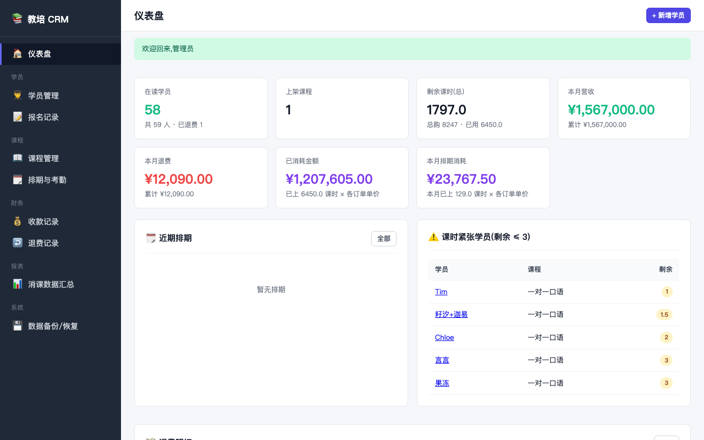
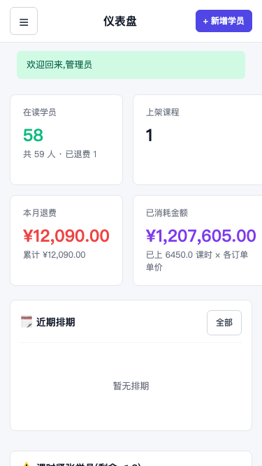
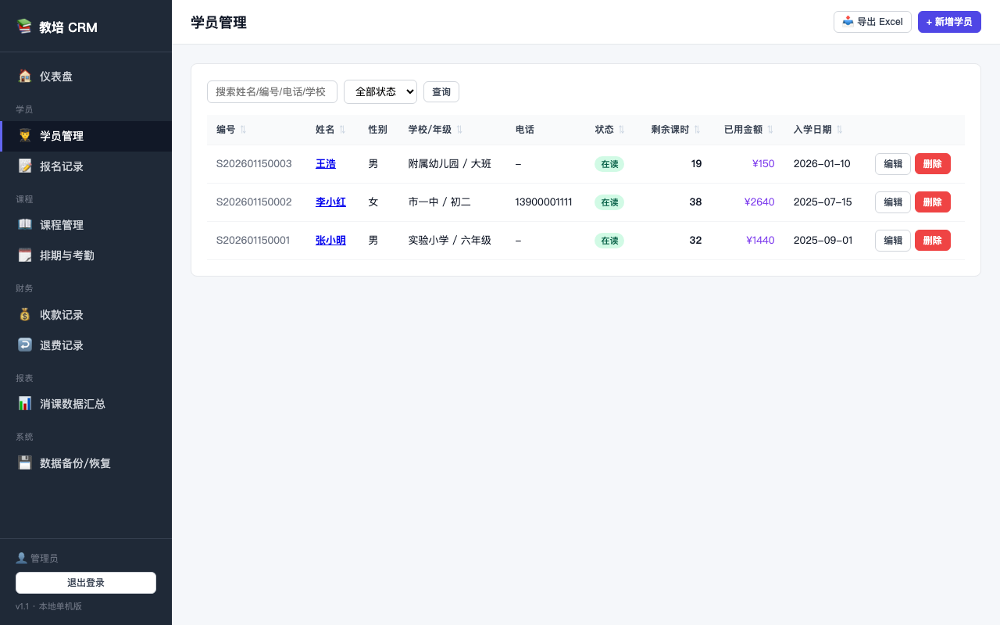
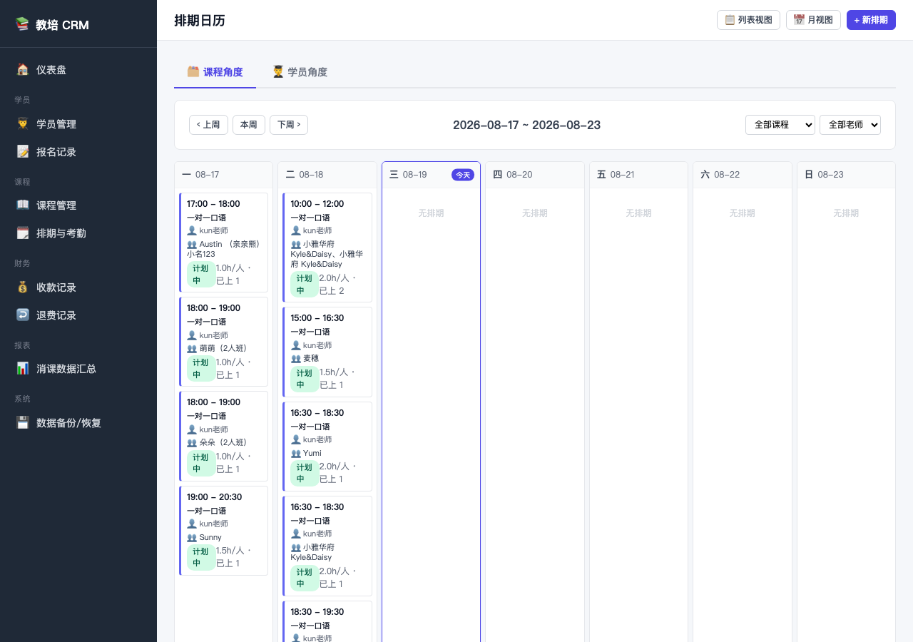

# 教培 CRM

> **🌐 Languages:** **中文** | [English](./README.en.md)

一个为教培行业(培训机构)设计的本地单机版学生关系管理系统。

> 适配范围:小型培训机构,1-2 个管理员,本机部署。功能聚焦:学员、课程、课时、费用、退费、排期考勤。

## ✨ 功能清单

| 模块 | 功能 |
|------|------|
| 🔐 登录 | 单管理员账号登录,会话 7 天 |
| 📊 仪表盘 | 在读学员数 / 剩余课时 / 本月营收 / 退费 / 近期排期 / 课时紧张学员 |
| 👨‍🎓 学员管理 | 学员登记、状态(在读/休学/结业/已退费)、联系人(可多个,可设主联系人) |
| 📖 课程管理 | 课程模板(学科/年级/班型/单价/默认课时包) |
| 📝 报名 | 学员报名某课程,购买课时包,记录实付/优惠/未结 |
| 🗓️ 排期 | 列表视图 + **日历视图**(按周显示,看每天的课次和出勤学员) |
| 👥 考勤 | 在排期里登记每个学员出勤/缺席/补课/请假,自动扣课时 |
| ⏱️ 课时流水 | 手工调整课时(赠送/扣减),每次操作记一笔账 |
| 💰 收款 | 登记每笔收款(类型/方式/时间),支持关联报名 |
| ↩️ 退费 | 登记退费,自动把报名置为已退费 |
| 📥 Excel 导出 | 学员/报名/收款/退费 一键导出 xlsx |
| 🔍 筛选 | 学员/课程/报名都支持搜索 + 状态过滤 |

## 📸 预览

### 桌面端 — 仪表盘



### 移动端 — 响应式适配(< 600px 自动变抽屉式侧边栏)



### 学员管理



### 排期日历(周视图)



## 🔐 默认账号

启动后用 `admin` / `admin123` 登录。**首次登录后建议**:
1. 修改 `config.py` 里的 `SECRET_KEY`(生产前必须)
2. 在 admin 后台修改 admin 密码

## 🚀 快速开始

### 三种启动方式,任选其一

#### 方式 A:一键脚本(推荐,适合所有人)

**macOS / Linux**:
```bash
bash start.sh
```

**Windows**:
双击 `start_crm.bat`

脚本会:① 创建/激活 venv → ② 装依赖 → ③ 启动 `run.py`(**自动 init 数据库 + 自动开浏览器**)

#### 方式 B:Makefile(macOS / Linux 程序员)

```bash
make install      # 装依赖(自动建 venv)
make run          # 启动(run.py 会自动 init)
make init         # 手动初始化(带示例数据)
make init-empty   # 初始化(不带示例)
make reset        # ⚠ 删库重建
make backup       # 手动备份
make stop         # 停服务
```

#### 方式 C:手动启动(全平台)

```bash
# 1. 装依赖
python3 -m venv venv
source venv/bin/activate              # macOS/Linux
# .\venv\Scripts\Activate.ps1        # Windows PowerShell
pip install -r requirements.txt

# 2. 启动(run.py 会自动检测 db,不存在则自动 init)
python3 run.py
```

### 默认行为

- **端口**:`5050`(`PORT=5050 python3 run.py` 可改)
- **数据库**:`instance/crm.db`(`.gitignore` 已排除,不会入库)
- **自动初始化**:`run.py` 检测到 db 不存在时,**自动调用** `init_db.py` 写入示例数据
- **自动开浏览器**:`run.py` 启动后自动打开(传 `--no-browser` 关闭)

### 从 GitHub 拉取后跑起来

```bash
git clone https://github.com/你的用户名/crm-education.git
cd crm-education
bash start.sh              # 或 make install && make run
# 浏览器自动开 → admin / admin123 登录
```

## 📁 目录结构

```
crm-education/
├── app.py              # Flask 工厂 + 入口
├── run.py              # 启动脚本 (auto-init + auto-open browser)
├── start.sh            # macOS/Linux 一键启动
├── start_crm.bat       # Windows 一键启动
├── Makefile            # make run/init/reset/backup/stop
├── config.py           # 配置
├── extensions.py       # SQLAlchemy 实例
├── models.py           # 数据模型(9 张表,含 HourAdjustment 课时流水)
├── init_db.py          # 建表 + 示例数据 + 默认管理员
├── backup_now.py       # 手动备份脚本
├── requirements.txt
├── README.md
├── .gitignore          # 排除 db/venv/缓存/日志
├── instance/           # 运行时数据(不进 git)
│   ├── crm.db          # SQLite 数据库(自动生成)
│   ├── backups/        # 自动备份
│   └── *.log
├── routes/             # 蓝图
│   ├── auth.py dashboard.py students.py courses.py
│   ├── enrollments.py schedules.py calendar.py
│   ├── payments.py refunds.py exports.py reports.py admin.py
├── templates/          # Jinja2 模板
│   ├── base.html
│   ├── dashboard.html
│   └── auth/ admin/ students/ courses/ enrollments/
│       schedules/ payments/ refunds/ reports/
└── static/
    └── css/style.css
```

## 🗃️ 数据模型

- **Student** 学生(姓名/性别/出生/学校/年级/电话/状态)
- **Contact** 联系人(姓名/关系/电话/微信,一对多挂学生)
- **Course** 课程模板(学科/年级/班型/单价/默认课时包)
- **Enrollment** 报名(学员↔课程,购买课时,实付/优惠/未结)
- **Schedule** 排期(挂课程,老师/教室/时间/容量)
- **ScheduleAttendance** 出勤(排期↔报名,扣课时)
- **Payment** 收款(学员/报名/金额/方式/时间)
- **Refund** 退费(学员/报名/金额/原因/方式)
- **HourAdjustment** 课时手工调整流水(赠送/扣减)
- **User** 管理员账号(支持多管理员 + bcrypt 密码)

> 课时计算规则:
> - `Enrollment.used_hours` 在每次"出勤/补课"时累加,删除会回退
> - `remaining_hours = total_hours - used_hours`
> - 剩余为 0 时报名自动标记为"已用完"

## 💡 常见操作

| 场景 | 步骤 |
|------|------|
| 新学员报名并收款 | 学员管理 → 新增 → 然后"新报名" → 然后"收款" |
| 排一次课 | 课程详情 → 新排期 → 填时间/老师/教室 |
| 登记谁上了课 | 排期详情 → 添加出勤 → 选学员 + 出勤/补课(自动扣课时) |
| 学员转走要退费 | 学员详情 → 退费 → 选报名 → 填金额(会自动给建议) |
| 看本月营收 | 仪表盘 / 收款记录 |
| 哪些学员要续费了 | 仪表盘 → 课时紧张学员(剩余 ≤ 3) |

## 🔮 之后想加什么

- [x] 导出 Excel ✅
- [x] 学员课时流水 ✅
- [x] 多管理员 + 登录密码 ✅
- [x] 课表日历视图 ✅
- [x] 移动端自适应(响应式 CSS)✅
- [ ] 学员请假补课自动排期
- [ ] 排期冲突检测(同一老师同时段不能排两节课)
- [ ] 数据看板图表(替代当前纯数字)

## ❓ 故障排查

- **打开页面 500 错误** —— 看 `instance/crm.db` 是否被其他程序占用,或检查 `pip install` 是否完整
- **数据库被锁** —— 杀掉所有 Python 进程,或重启电脑
- **中文乱码** —— Python 3.7+ 默认 UTF-8,如乱码检查 `run.py` 启动时的 locale
- **端口被占** —— `PORT=5051 python3 run.py` 换端口;或 `make stop` 停掉
- **忘记密码** —— 用 SQLite 工具打开 `instance/crm.db`,在 users 表里手动改 password_hash 字段;或 `python3 init_db.py --reset` 重建(丢数据)
- **mac 上 5000 端口被 ControlCe 占用** —— run.py 默认 5050,已绕开

## 📜 License

MIT
